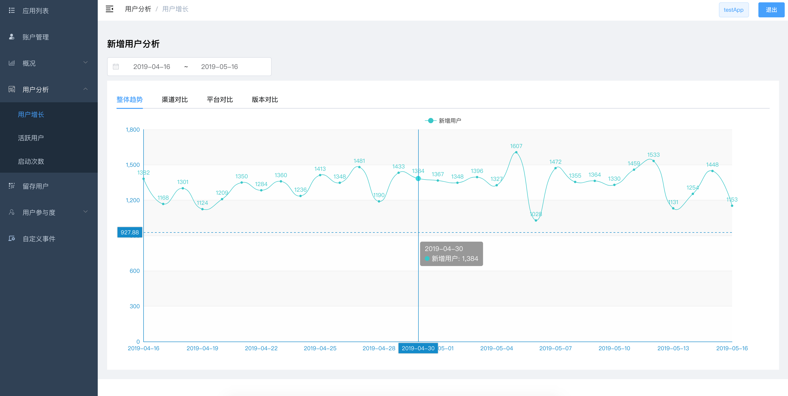
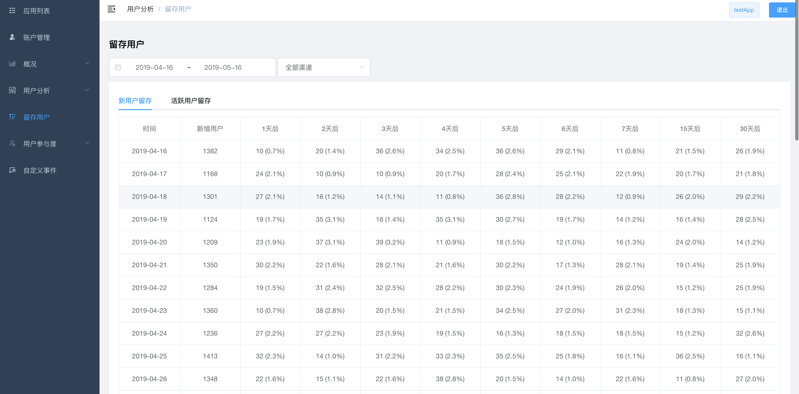
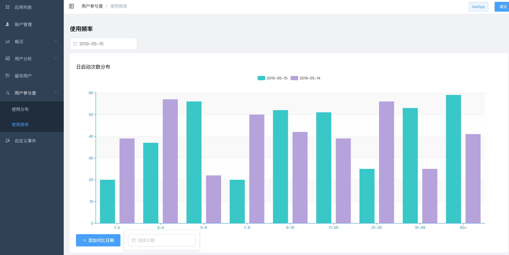

<h1 align="center"> GoAnalytics-Web </h1>

### 项目介绍

GoAnalytics-Web是基于vue和vue-admin-templace实现的 [GoAnalytics](https://github.com/lt90s/goanalytics) 前台数据展示页面。


### 构建

```
git clone https://github.com/lt90s/goanalytics-web
cd goanalytics-web
npm install
npm run dev
```


### 数据展示

* 整体趋势


* 用户增长



* 用户留存



* 使用频率


